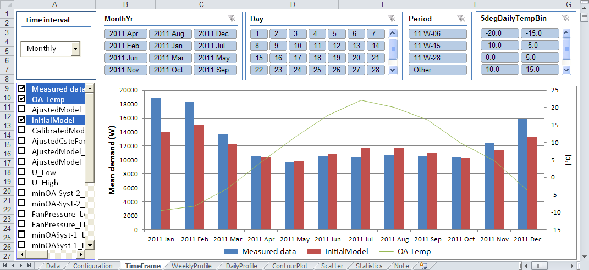
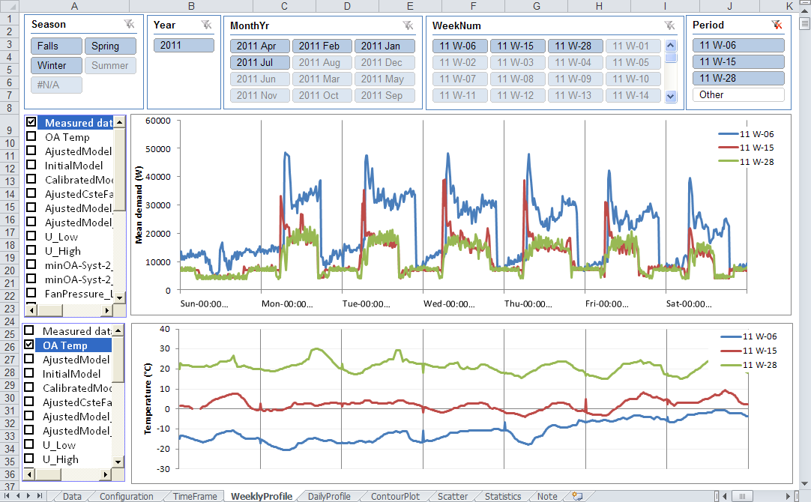
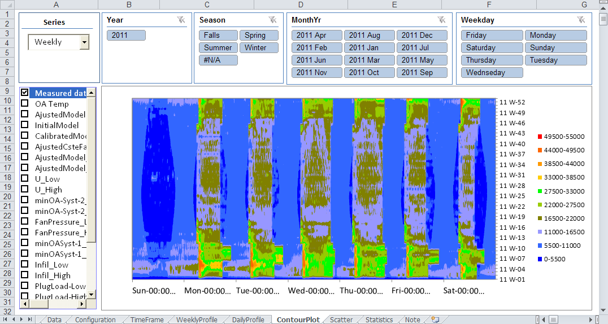
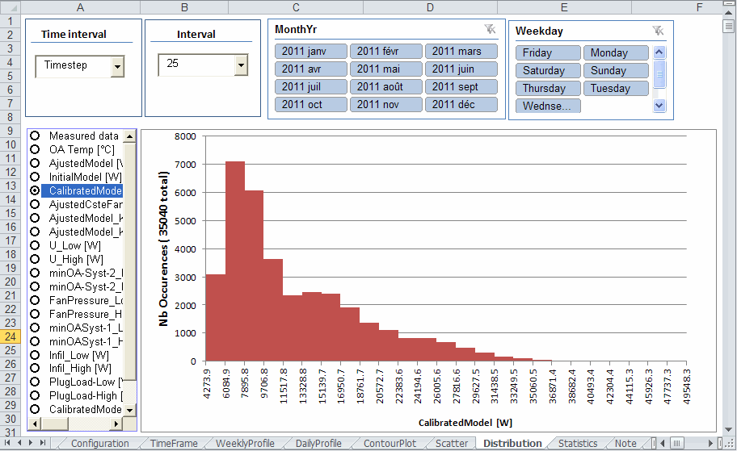

English is following.

# VizBEM - Visualisation de Données de Performance Énergétique

## Description

VizBEM est un fichier modèle Excel permettant de visualiser des séries temporelles de données. VizBEM a été développé pour faciliter l'analyse des données mesurées et simulées de performance énergétique de bâtiments. 

Différents onglets permettent de visualiser les données sous différents angles (profil quotidien, profil hebdomadaire, graphique de nuage, de contour, de distribution) et de comparer statistiquement un profil simulé et mesuré. L'utilisation des tableaux dynamiques croisés et des segments permet une présentation rapide et conviviale des données et confère une grande flexibilité à l'outil pour adapter les onglets aux besoins spécifiques de l'usager.

## ⭐ Nouveautés Version 1.8 (2021-11-12)

- Fichier Excel compatible avec Excel 365

## 📋 Fonctionnalités

### 1. TimeFrame
Présentation générale des données sous différents intervalles de temps (horaire, quotidien, mensuel)

### 2. WeeklyProfile
Présentation des données sous forme de séries hebdomadaires

### 3. DailyProfile
Présentation des données sous forme de séries quotidiennes

### 4. ContourPlot
Présentation des données sous forme de graphique de contour

### 5. Scatter
Présentation des données sous forme de graphique de points

### 6. Distribution
Présentation des données sous forme de graphique de distribution

### 7. Statistics
Calcule et affiche des indices statistiques comparant un profil simulé et mesuré

### 8. InverseModel 
Évalue plusieurs modèles inverses avec point flottant en accord avec l'ASHRAE guideline 14

### 9. DailyCluster 
Regroupe les profils quotidiens selon leur degré de similitude en un nombre de classes défini par l'usager

## 🚀 Installation

Téléchargez le fichier VizBEM (1.2.8).zip, extraire les fichier et ouvrir le fichier Excel. Pour que l'onglet "DailyCluster soit fonctionnel, les fichiers DLL du fichier zip doivent être dans le même dossier que le fichier Excel.

## 📖 Utilisation

L'onglet "Getting Started" dans le fichier Excel donne les indications pour utiliser le fichier et pour y importer vos propres données.

   

# VizBEM - Building Energy Performance Data Visualization

## Description

VizBEM is an Excel template file allowing to visualize timeseries data. VizBEM has been developed to facilitate the analysis of measured and simulated building performance data.

Different worksheets present specific views of data (Daily profile, weekly profile, contour, scatter and distribution plots) and statically compare measured and simulated profiles. The use of pivot table and slicers allows a quick and user friendly presentation of data and gives high flexibility to adapt views to user needs.

## ⭐ New Features Version 1.8 (2021-11-12)

- Excel file compatible with Excel 365

## 📋 Features

### 1. TimeFrame
Overview of data under different time intervals (Timestep, Hourly, Daily, Monthly, Annually)

### 2. WeeklyProfile
Presentation of data under week series

### 3. DailyProfile
Presentation of data under daily series

### 4. ContourPlot
Presentation of data with contour plot

### 5. Scatter
Presentation of data with scatter plot

### 6. Distribution
Presentation of data with distribution plot

### 7. Statistics
Computes and prints statistical indices qualifying the difference between simulated and measured data

### 8. InverseModel
Includes Inverse Modeling Change Point Models in accordance with ASHRAE Guideline 14

### 9. DailyCluster
Gathers daily profiles on different number of classes defined by the user according to their similarities

## 🚀 Installation

Download VizBEM (1.2.8).zip file, extract files and open the Excel file. For the "DailyCluster" tab to be functional, the DLL files from the zip file must be in the same folder as the Excel file.

## 📖 Usage

The "Getting Started" worksheet gives indication how to use the tool and import your own data.

